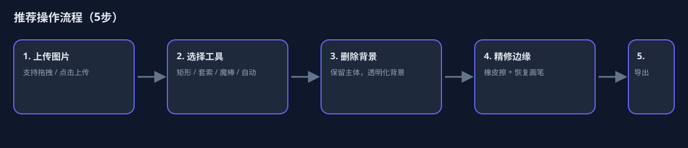
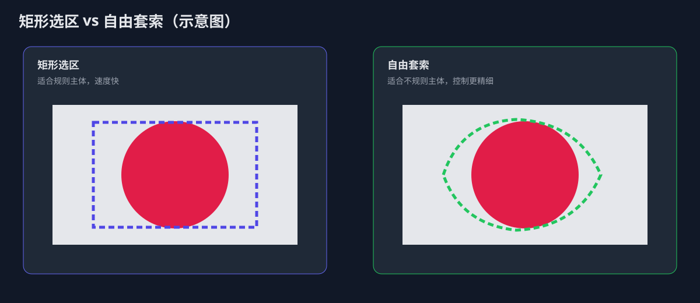
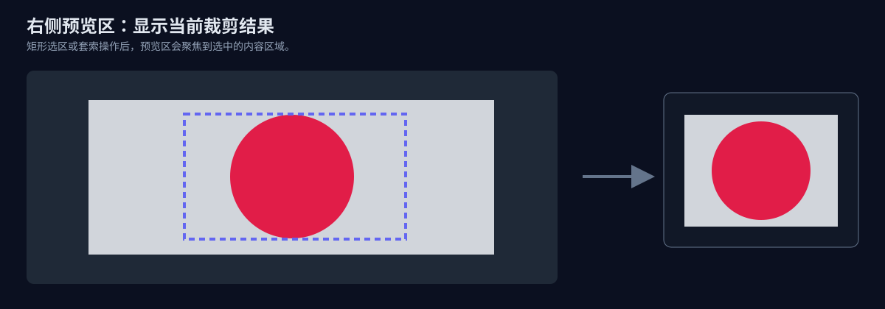

# 特效素材制作器

一个纯前端的图片背景去除 / 抠图工具，用于快速制作抖音等平台的特效素材图片。上传任意图片，通过多种抠图工具去除背景，导出干净的透明底素材。



## 功能亮点

- **选区抠图**：支持矩形选区与自由套索两种方式，适配规则与不规则主体。
- **主体保留、背景去除**：选区类工具会优先保留主体区域，再去除背景。
- **右侧预览聚焦**：选区操作后，预览区自动聚焦到当前裁剪区域，便于快速确认结果。
- **多种自动化抠图能力**：取色去背景、魔棒、自动去背景。
- **手动精修**：橡皮擦 + 恢复画笔，可修边、补边。
- **可调参数**：容差、羽化、画笔尺寸等实时可调。
- **多格式导出**：PNG / JPG / WebP，并支持导出时按内容自动裁剪。
- **撤销重做**：最多 30 步历史记录。

## 界面与工具示意

### 1) 矩形选区 vs 自由套索



### 2) 预览区聚焦裁剪结果



## 快速开始

```bash
# 克隆项目
git clone <repo-url>
cd effect_sucai_make

# 启动服务
node server.js

# 浏览器访问
# http://localhost:3000
```

> 也可以直接双击打开 `index.html` 使用（无需启动服务）。

## 工具说明

| 工具 | 快捷键 | 用法 |
|------|--------|------|
| 矩形选区 | `V` | 拖拽框选区域，按 `Delete` 去除选区背景并保留主体 |
| 自由套索 | `L` | 手绘闭合区域，按选区形状保留主体并去除背景 |
| 取色去背景 | `C` | 点击背景色，全图去除相似颜色 |
| 魔棒工具 | `W` | 点击某处，从该点 flood-fill 去除连通相似色块 |
| 自动去背景 | `A` | 一键检测边缘背景色并去除 |
| 橡皮擦 | `E` | 拖拽擦除不需要区域 |
| 恢复画笔 | `R` | 拖拽恢复误删区域 |
| 移动画布 | `H` | 拖拽平移画布 |

### 其他快捷键

| 操作 | 快捷键 |
|------|--------|
| 撤销 | `Ctrl + Z` |
| 重做 | `Ctrl + Shift + Z` / `Ctrl + Y` |
| 导出 | `Ctrl + S` |
| 适应窗口 | `Ctrl + 0` |
| 放大 / 缩小 | `+` / `-`（或鼠标滚轮） |
| 删除选区背景 | `Delete` / `Backspace` |
| 取消选区 | `Esc` |

## 推荐使用流程

1. **上传图片**：点击上传按钮或直接拖拽图片。
2. **先粗抠**：
   - 规则主体优先用 **矩形选区**；
   - 不规则主体优先用 **自由套索**。
3. **自动去背景**：可结合取色/魔棒/自动工具清理背景残留。
4. **精修边缘**：用橡皮擦和恢复画笔处理细节。
5. **预览确认**：在棋盘格、白、黑、绿背景中切换检查。
6. **导出素材**：建议优先导出 PNG（透明底）。

## 导出格式建议

| 格式 | 特点 | 推荐场景 |
|------|------|----------|
| PNG | 透明背景、无损 | 特效素材首选 |
| JPG | 白底、体积小 | 不需要透明背景 |
| WebP | 透明背景、体积更小 | 兼顾质量与大小 |

## 项目结构

```text
effect_sucai_make/
├── index.html
├── css/style.css
├── js/app.js
├── server.js
├── docs/images/         # README 插图
└── README.md
```

## 技术实现要点

- **Canvas 像素级处理**：直接修改 ImageData 的 alpha 通道。
- **Flood Fill（BFS）**：用于魔棒与自动去背景。
- **羽化边缘**：通过距离衰减实现柔和过渡。
- **Alpha Mask 架构**：原图数据不直接破坏，便于撤销和恢复。

## License

MIT
